# 数据库Lab2实验报告

## 实验报告目录

- [基本信息](#jibenxinxi)
  - [组队信息](#zuduixinxi)
  - [技术栈](#jishuzhan)
- [系统介绍](#xitongjieshao)
  - [背景介绍](#beijingjieshao) 
  - [需求分析](#xuqiufenxi)
    - [玩家](#wanjia) 
    - [策划](#cehua)
  - [数据库设计](#shujvkusheji)
    - [ER图](#ertu)
      - [玩家](#wanjiaertu)
      - [策划](#cehuaertu)
    - [数据库](#shujvku)
- [系统设计](#xitongsheji)
  - [主页面](#zhuyemian)
  - [玩家](#wanjia2)
    - [登录](#wanjiadenglu)
    - [注册](#wanjiazhuce)
    - [功能](#wanjiagongneng)
  - [策划](#cehua2)
    - [登录](#cehuadenglu)
    - [策划功能](#cehuagongneng)
- [系统功能实现](#xitonggongnengshixian)
  - [功能实现代码](#gongnengshixiandaima)
- [心得体会](#xindetihui)

<a name="jibenxinxi"></a> 

***

## 基本信息

<a name="zuduixinxi"></a>

### 组队信息

#### PB21071466 张皓谦：主要负责前端网页样式的设计，前端代码的实现，数据库实现

#### PB21020706 姜一夫：主要负责后端代码的实现，前后端接口的实现，需求分析，实验报告书写

<a name="jishuzhan"></a>

### 技术栈

- MySQL
- HTML
- CSS
- Flask
- JavaScript

<a name="xitongjieshao"></a>

***

## 系统介绍

<a name="beijingjieshao"></a>

### 背景介绍

本实验的目标是洛克王国宠物信息管理系统，类似于学生信息管理系统，其用户为洛克王国游戏的玩家与策划，玩家可以参与各种活动以获得宠物，也可以手动放生宠物，策划可以发布活动，更新宠物信息库，进行对玩家的惩罚

<a name="xuqiufenxi"></a>

### 需求分析

对于两种用户，他们各自应该可以在个人界面看到自己的相关信息，比如玩家可以在个人界面看到自己的id，游戏昵称，策划可以在个人界面看到自己的工号等

<a name="wanjia"></a>

#### 玩家

- 需要可以查询现在可以参加的活动信息
- 需要可以修改自身账户的密码
- 需要可以查询自己现有的宠物信息
- 需要可以选择放生自身的宠物
- 需要可以查询自己现有的装备信息

<a name="cehua"></a>

#### 策划

- 需要可以新增相关活动
- 需要可以新增宠物，装备
- 需要可以修改宠物的各项信息
- 需要可以修改装备的各项信息
- 需要可以对玩家进行处罚（删除玩家账号）
- 需要可以看到自己的相关信息

<a name="shujvkusheji"></a>

### 数据库设计

<a name="ertu"></a>

#### ER图

<a name="wanjiaertu"></a>

##### 玩家


设计思想：对于玩家而言，需要能够知道自己的账号信息，即各项属性，同时玩家可以选择加入某个家族，一个家族可以拥有多位成员，玩家可以参加多项活动，玩家可以拥有多只宠物，可以拥有多个装备

<a name="cehuaertu"></a>

##### 策划


设计思想：对于策划而言，需要能够知道自己的各项信息，同时策划可以发布多项活动，可以惩罚多名玩家，可以对宠物信息进行修改，可以新增未有的宠物信息，可以发布多项活动并决定活动奖励

<a name="shujvku"></a>

#### 数据库

##### **player**(<u>id</u>, gender,gameid,grade,family,password)

player表记录了玩家的基本信息，其中id为主键，id表示玩家账号，gender表示玩家性别，gameid表示玩家的游戏昵称，grade表示玩家的天梯分数，family表示玩家的家族，password表示玩家的账号密码，该范式为BCNF

##### **manager**(<u>manaid</u>,manapasswd,mananame)

manager表记录了策划的各项信息，其中manaid是主键，表示策划的id，manapasswd表示策划的账号密码，mananame表示策划的昵称，该范式为BCNF

##### **pet**(<u>petid</u>,department,racevalue,bloodline,acqstate,skill,petname)

pet表记录了宠物的相关信息，其中petid为主键，petid表示宠物id，department表示宠物系别，racevalue表示种族值，bloodline表示宠物血脉，acqstate表示宠物是否可获得，skill表示宠物技能，petname表示宠物名字，该范式为BCNF

##### **equipment**(<u>ename</u>,etype,actiid)

equipment表记录了装备的相关信息，其中ename为主键，ename表示装备名字，etype表示装备类型，actiid表示装备获得的活动id，actiid参考activity表，该范式为BCNF

##### **activity**(<u>actiid</u>,actiname,reward,actitype)

activity表记录了活动信息，其中actiid为主键，actiid表示活动id，actiname表示活动名字，reward表示活动可获得的奖励，可以是宠物或者装备，actitype表示活动奖励的类型，该范式为BCNF

##### **petbag**(<u>id</u>,<u>petid</u>)

petbag表记录了玩家的宠物拥有情况，其中id的参考player表，petid参考pet表，该范式为BCNF

##### **equipbag**(<u>id</u>,<u>ename</u>)

equipbag表记录了玩家的装备拥有情况，其中id参考player表，ename参考equipment表，该范式为BCNF

***

<a name="xitongsheji"></a>

### 系统设计

<a name="zhuyemian"></a>

#### 主页面


当我们打开系统时会看到这样一个画面，当我们滚动鼠标滚轮时，会进入一个洛克王国游戏发展史回忆录

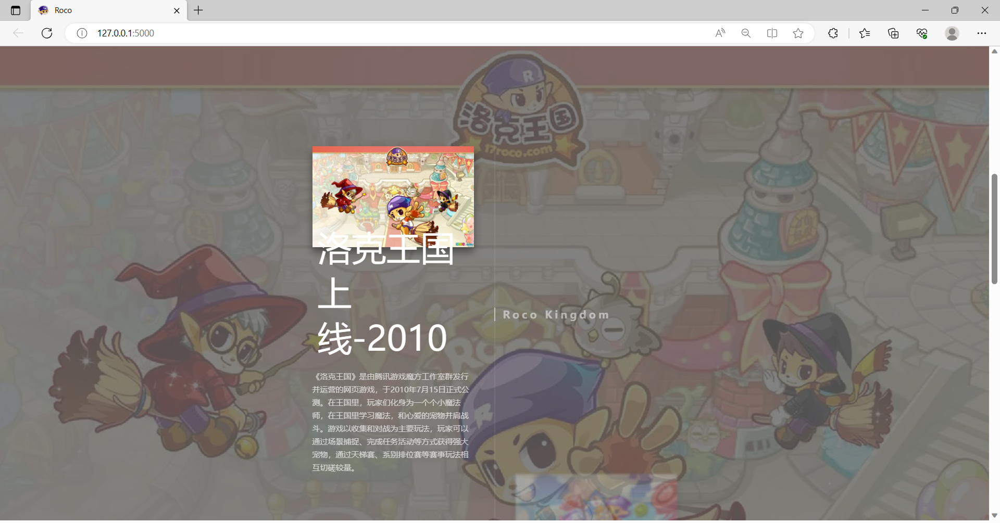

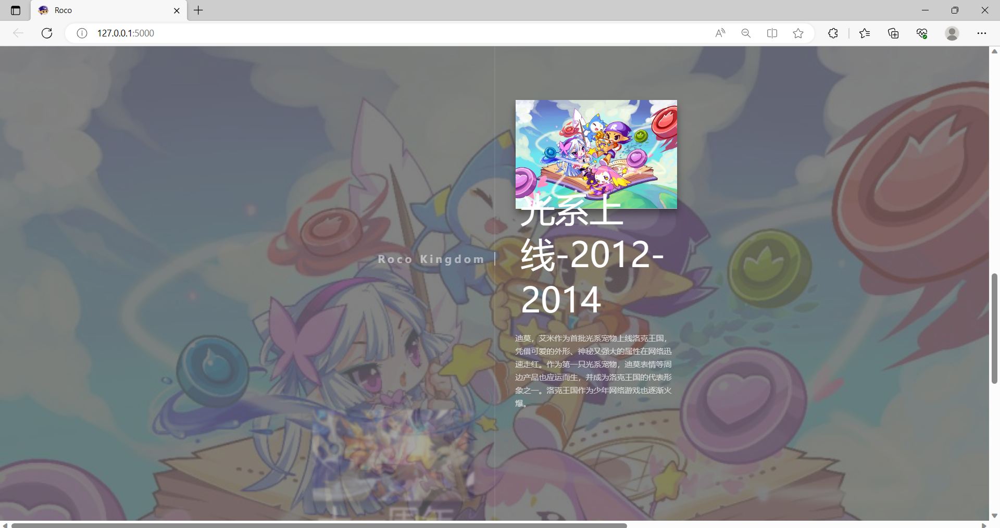


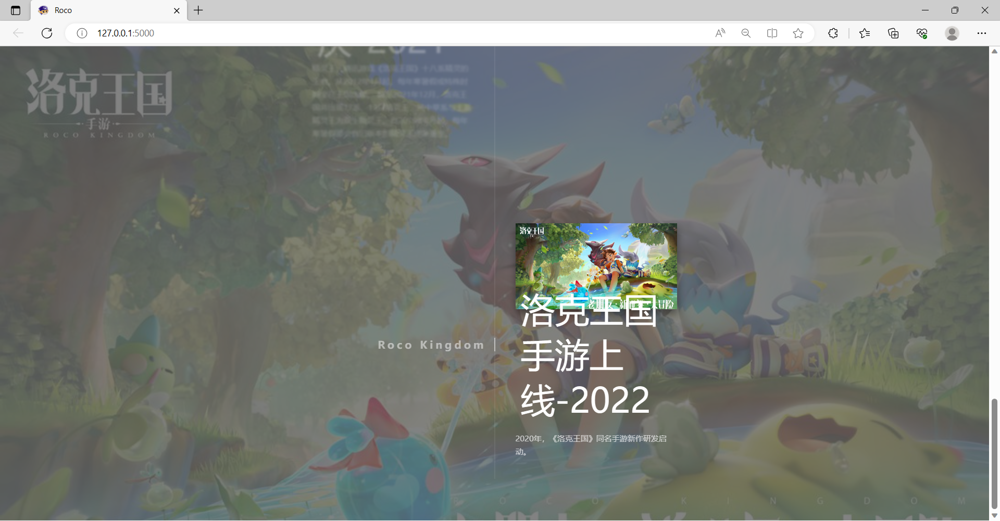

但我们点击主页面中的“官网首页”选项，将会跳转至游戏官网

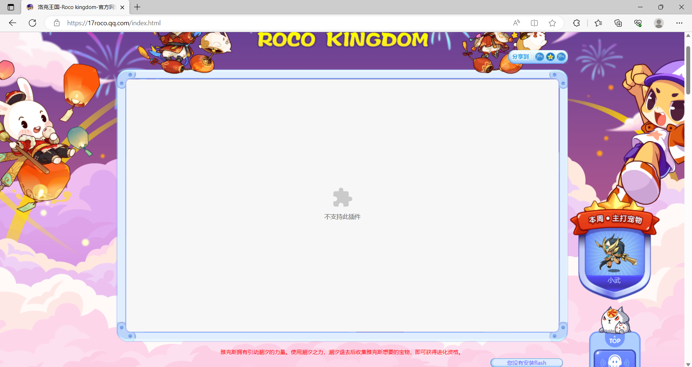

同理我们可以点击主页面的其他按钮，会各自跳转到不同页面

<a name="wanjia2"></a>

#### 玩家

<a name="wanjiadenglu"></a>

##### 登录

在主页面点击登录按钮，我们进入玩家的登录界面

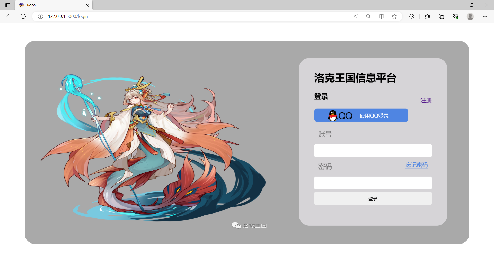

在输入账号密码后，如果账号密码不正确，则会出现提示

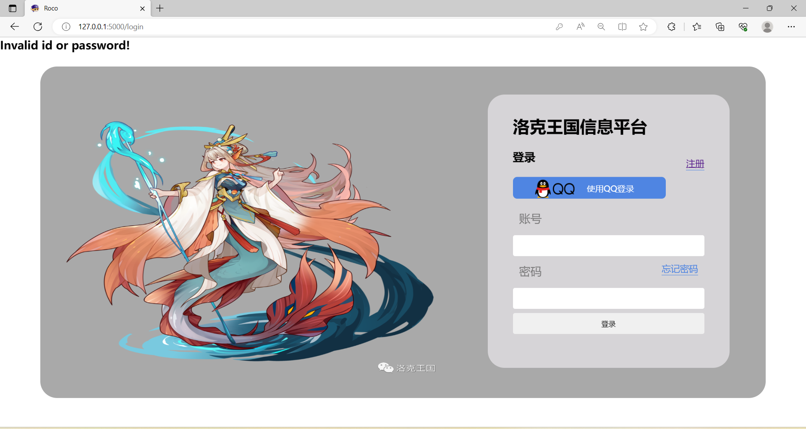

在输入了正确的账号密码后我们进入玩家的个人界面

<a name="wanjiagongneng"></a>

##### 玩家功能

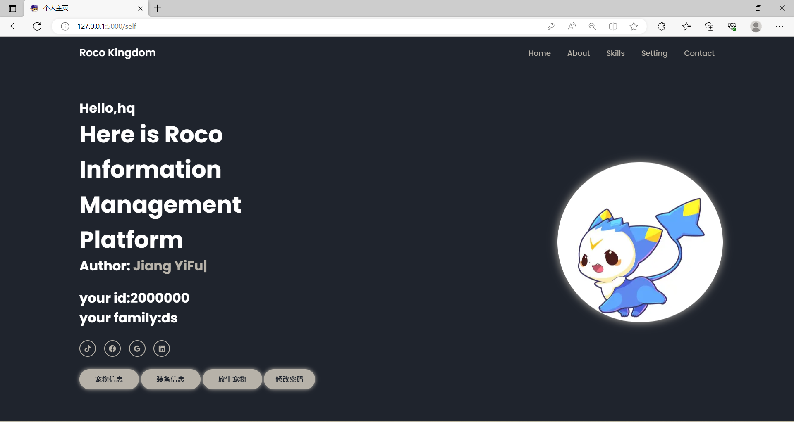

点击宠物信息按钮可以查看玩家拥有的宠物信息

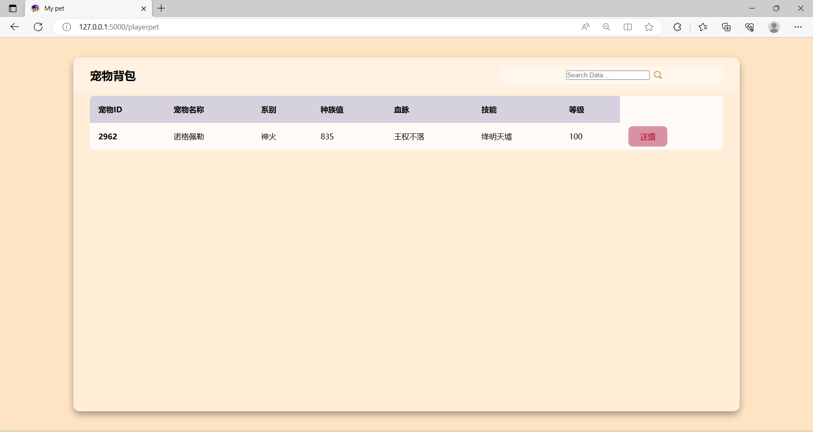

点击装备信息按钮可以查看玩家拥有的装备信息

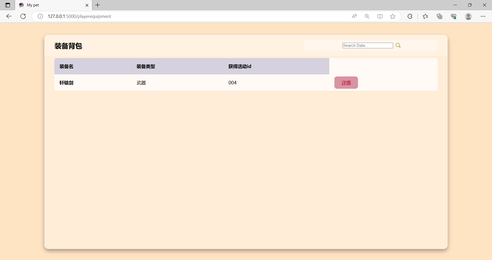

点击放生按钮进入放生宠物按钮

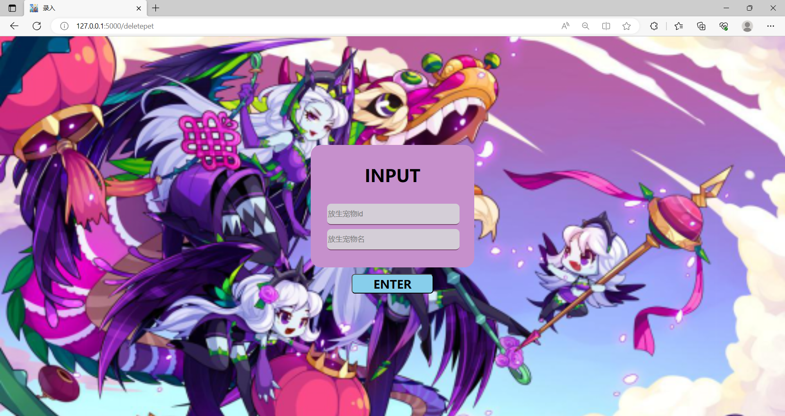

点击修改密码按钮进入密码修改界面

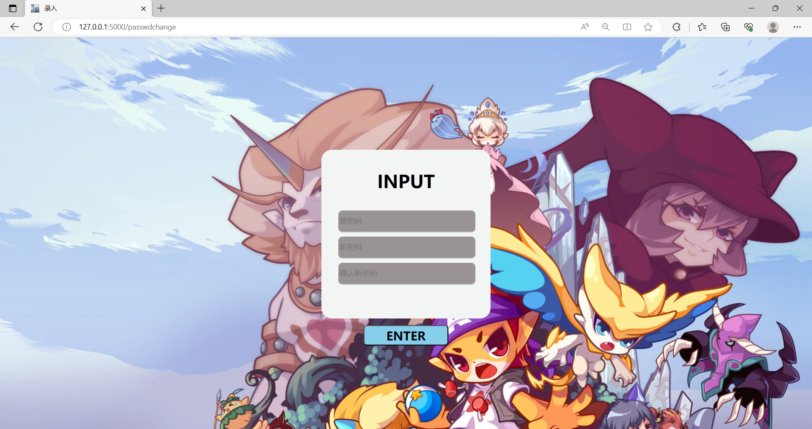

<a name="wanjiazhuce"></a>

##### 注册

让我们回到玩家登录界面，点击注册按钮，进入玩家账号注册界面

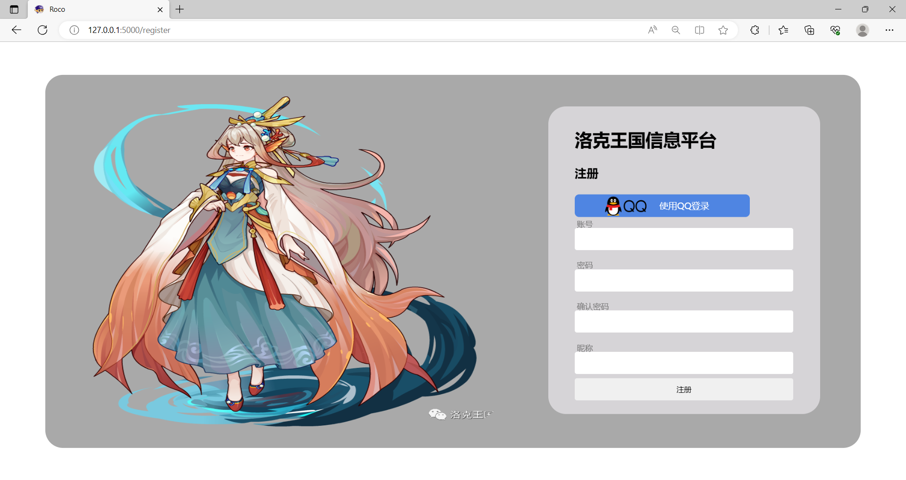

输入我们预设的账号密码，如果我们预设的账号与已有账号重复或者密码与确认密码不同，则会发出提示

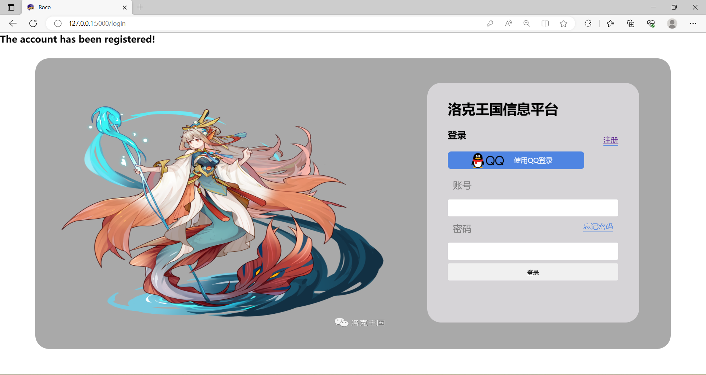


<a name="cehua2"></a>

#### 策划

<a name="cehuadenglu"></a>

##### 登录

在主页面点击策划入口按钮进入策划的登陆界面

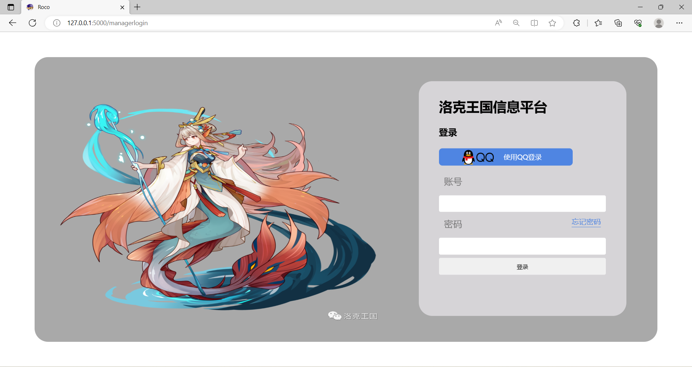

如果我们的密码错误或者账号不存在则会出现错误提示


登录成功则进入策划的个人界面

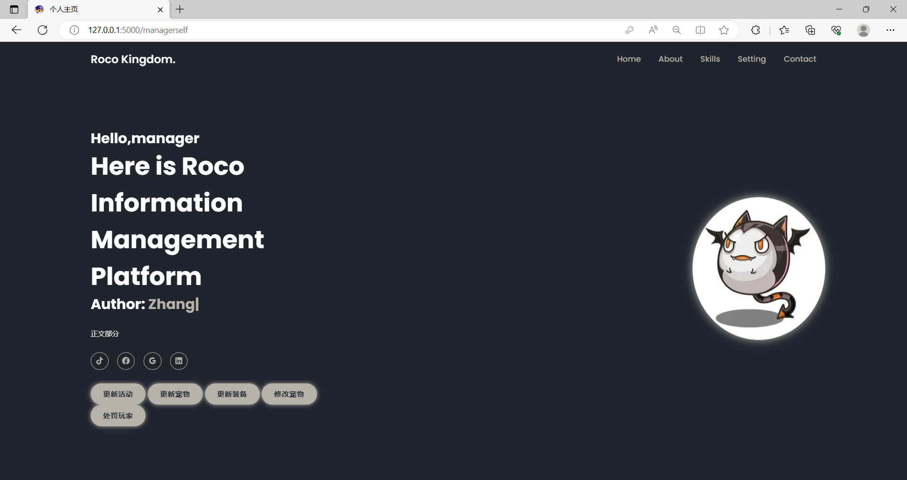

<a name="cehuagongneng"></a>

##### 策划功能

点击更新活动按钮开始更新活动，策划需要输入活动的各项信息

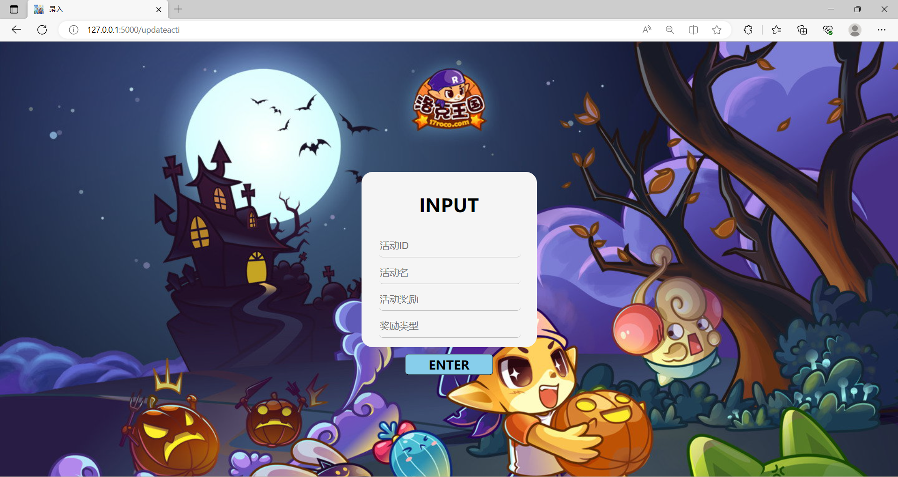

点击更新宠物按钮开始更新宠物信息库，策划需要输入宠物的各项信息

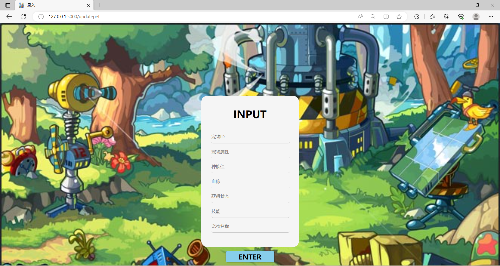

点击更新装备按钮开始更新装备信息库，策划需要输入装备的各项信息

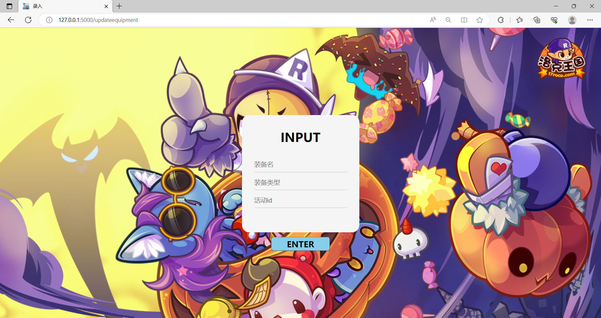

点击修改宠物按钮可以修改已有的宠物信息，策划需要输入宠物的各项信息

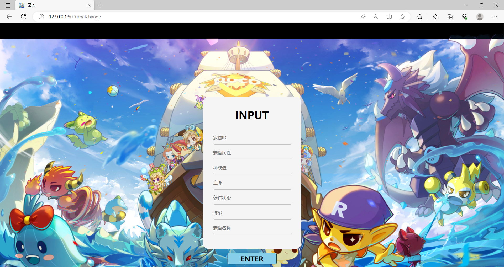

点击惩罚玩家按钮可以对特定玩家进行封禁账号

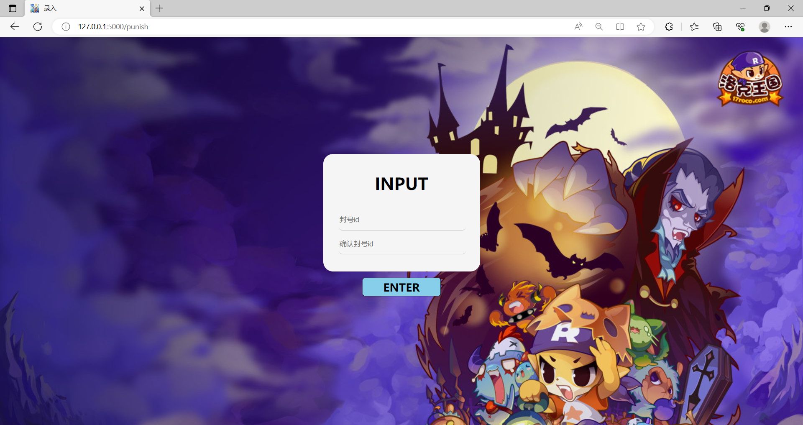

***

<a name="xitonggongnengshixian"></a>

### 系统功能实现

<a name="gongnengshixiandaima"></a>

#### 功能实现代码

其中后端代码主要用到pysql与flask框架，几个关键后端接口实现如下：

玩家的登录功能实现

``` python
@app.route("/login", methods=['POST','GET'])
def login():
    loginbool = False
    if request.method =='POST':
        name = request.form.get('name')
        passwd = request.form.get('passwd')
        data = conn_DB()
        data1 = conn_DB1(name)
        data2 = conn_DB4(name)
        data3 = conn_DB5(name)
        session['name'] = data1 #昵称
        session['id'] = data2 #id
        session['family'] = data3 #家族
        for temp in data:
            print(temp['用户名'], temp['密码'])
            if temp['用户名'] == name and temp['密码']==passwd:
                return redirect(url_for("self"))
                loginbool = True
        if loginbool == False:
            flash("Invalid id or password!", category="error")
    return render_template("Rocologin.html", show_login=True)
```

当登录网页发出POST请求时，后端会获取前端输入的用户名和密码，在数据库中的
表中查询是否含有相应的信息。若含有相应的信息，证明用户输入的信息正确，根据输入的用户名信息进入相对应的端口

策划更新活动实现：

```python
@app.route("/updateacti", methods=['POST','GET'])
def updateacti():
    if request.method =='POST':
        upactiid = request.form.get('actiid')
        upactiname = request.form.get('actiname')
        upreward = request.form.get('reward')
        upactitype = request.form.get('actitype')
        data = conn_DB9(upactiid)
        if data:
            flash("This id has existed!", category="error")
        else:
            conn = pymysql.connect(host="localhost", port=3306, user="root", password="123456", db="lkwg", charset="gb2312")
            cursor = conn.cursor()
            sql = "INSERT INTO `activity` (`actiid`, `actiname`, `reward`, `actitype`) VALUES ('%s', '%s', '%s','%s');"%(upactiid,upactiname,upreward,upactitype)
            cursor.execute(sql)
            conn.commit()
            cursor.close()
            conn.close()
            return redirect(url_for("manager"))
    return render_template("updateacti.html")
```

当登录网页发出POST请求时，我们将其信息存储，再与数据库进行连接，通过pymysql进行sql语句与python语句的转化，而后实现对数据库的修改

其余功能大致相似，不赘述

***

<a name="xindetihui"></a>

### 心得体会

##### PB21071466 张皓谦：
在课程《数据库系统概论》的数据库设计实验中，我主要负责数据库系统的前端网页设计和开发，主要用到的技术有html，css，javascript等。而这些技术都是我在实验的过程中学到的。在做这门实验之前，我还是连html文件都一知半解的菜鸟，现在已经可以结合这些来设计出类似游戏官网的网页了，这样的进步以及实验结束后看到自己做出的成果是很有成就感的，在此之外，这次实验也极大的锻炼了我在网上获取信息，在各个信息获取渠道解决实验中的疑惑的能力。比如除了常用的CSDN以外，我们现在可以使用各大GPT进行debug，或者参考优秀的游戏官网成品，通过挖掘他们的源码以及设计布局，参考优化我们自己的成果，但是我们在此次实验中还有很多不足和遗憾，比如我最后还是没能实现让用户自主更换头像的功能，有些网页风格差距过大（部分原因是为了保持我们选择的游戏的特色），以及转场加载动画没有用武之地，等等。但是我感谢数据库系统概论的这次实验打开了我通向前端设计的大门，也掌握了一些入门级别的前端设计技术，这是其他很多数理必修课程没能带给我的直观感受，我会以这次实验为基础，继续在前端设计这条道路上学习进步，同时也感谢和我同组的姜一夫同学，以及课程的助教们帮我解答疑惑。

##### PB21020706 姜一夫：
在这次数据库系统实现的过程中我感觉最大的收获就是对开发过程的了解，在这次实验之前，我对后端开发完全没有了解，有了解也大多只是知道几个概念，平时其他课程也基本没有实现项目的经历，故而在实现的过程中遇到了很多困难，特别是在项目刚开始的时候，因为对开发流程的不熟悉，对自己该做什么很茫然，代码书写的效率也很低，但是在最后ddl前狠心一点一点写最后把大部分功能实现之后心中非常畅快，还有一点就是通过与组员的合作意识到了交流的重要性，也意识到两个人两台电脑不能同时对代码进行编辑的麻烦，很感谢老师布置这样一个实验，也很感谢助教及时的问题答复，和我的组员对我的包容